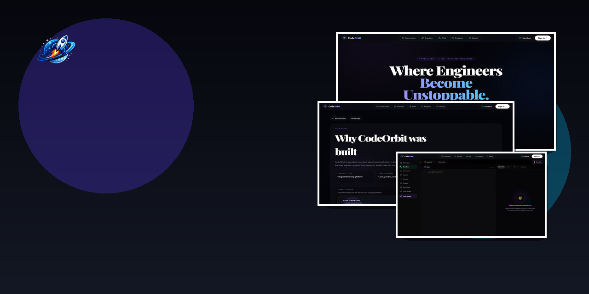
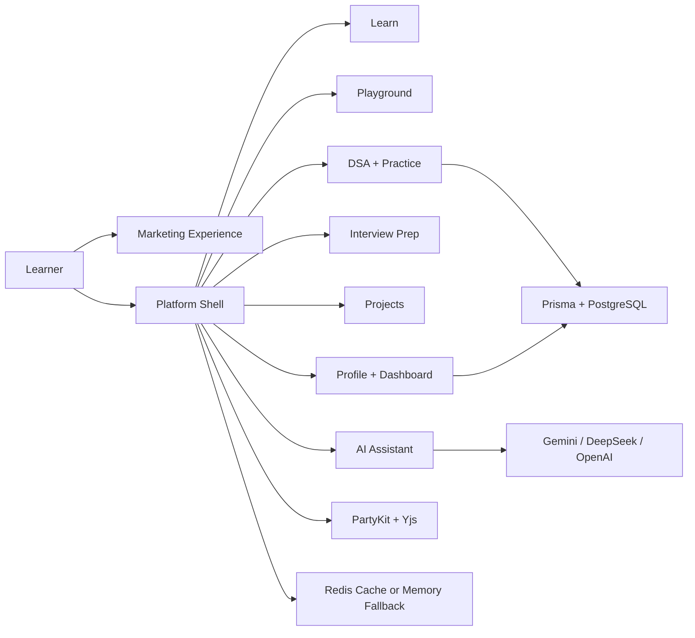
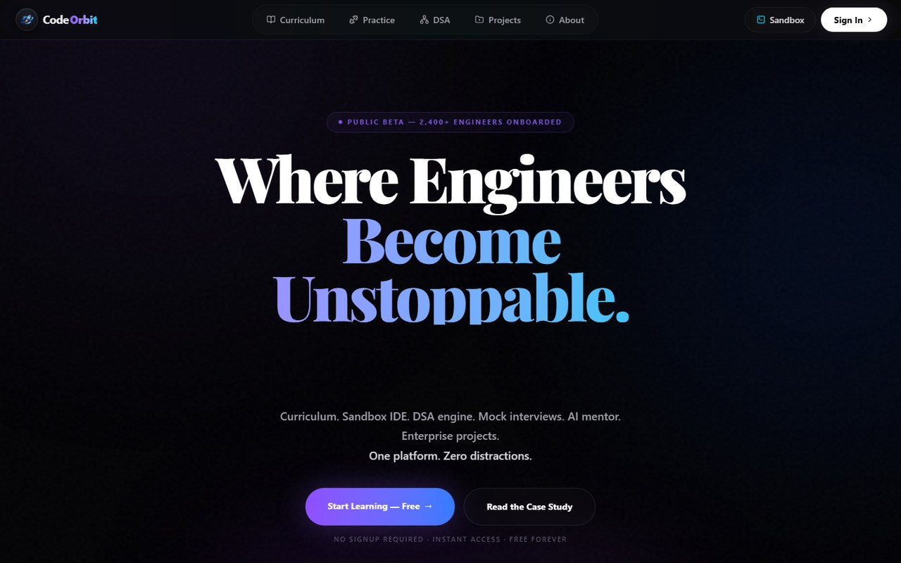
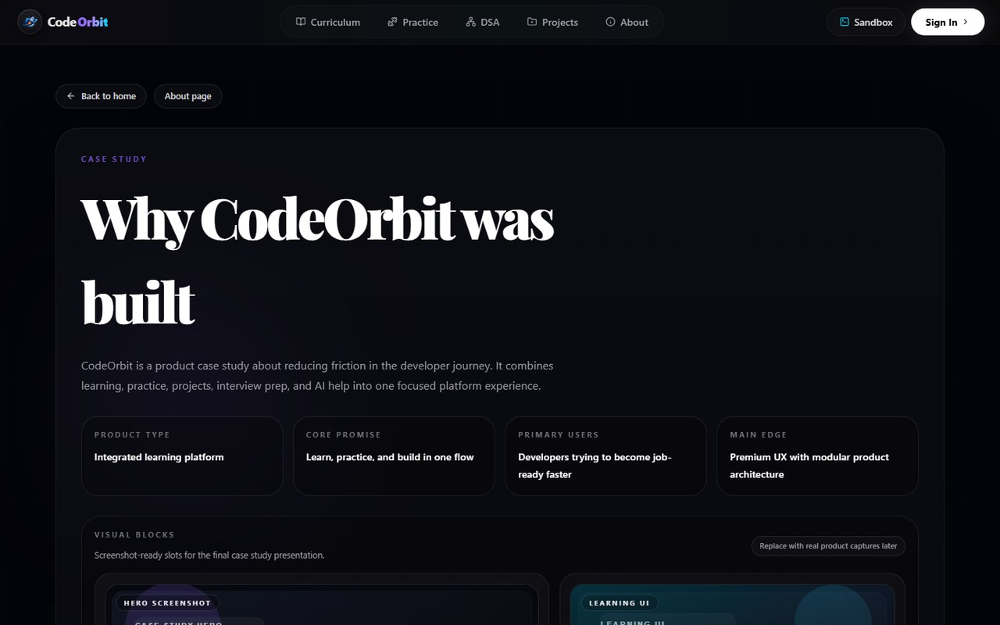
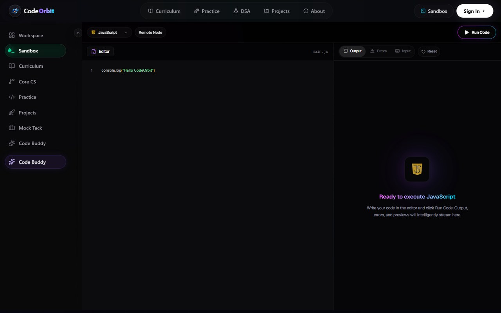
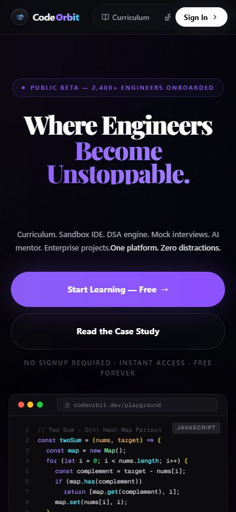

<p align="center">
  
</p>

<h1 align="center">CodeOrbit</h1>

<p align="center">
  A premium developer learning platform that unifies curriculum, coding playgrounds, AI help, DSA practice, interview prep, and project-based learning into one product flow.
</p>

<p align="center">
  <a href="https://github.com/Satya522/codeorbit/actions/workflows/ci.yml"></a>
  
  
  
  
</p>

<p align="center">
  <a href="https://codeorbit-xi.vercel.app"><strong>Live Demo</strong></a>
  ·
  <a href="https://codeorbit-xi.vercel.app/case-study"><strong>Case Study</strong></a>
  ·
  <a href="https://github.com/Satya522/codeorbit/actions/workflows/ci.yml"><strong>CI</strong></a>
</p>

<p align="center">
  
</p>

## What CodeOrbit Is

CodeOrbit is not a single-page portfolio or a thin tutorial wrapper. It is a full product-style Next.js application designed around a clear user journey:

1. Learn a concept.
2. Practice it in a structured way.
3. Build with it inside a real workspace.
4. Get unstuck with AI support.
5. Track progress like a serious product, not a toy dashboard.

The product combines:

- a marketing experience with strong product storytelling
- authenticated platform areas for learning, practice, projects, and profile
- AI-assisted help flows with provider-based routing
- Prisma-backed progress syncing
- PartyKit and Yjs collaboration foundations
- deployment-ready app structure with CI, docs, and repo hygiene

## Why This Project Stands Out

- **Product thinking first**: the routes map to user goals, not random demo pages
- **Feature-driven architecture**: core logic lives inside focused modules instead of bloated shared files
- **Modern frontend depth**: App Router, React 19, Tailwind 4, typed APIs, streaming-ready AI flows
- **Operational maturity**: CI, issue templates, Dependabot, CODEOWNERS, security policy, deployment docs
- **Real extensibility**: database, AI providers, and realtime layers are structured to evolve without a rewrite

## Feature Tour

| Area | Route | What it does |
| --- | --- | --- |
| Landing experience | `/` | Premium marketing surface that sells the product vision clearly |
| Product story | `/about`, `/case-study`, `/open-source` | Explains the why, the architecture, and the roadmap value |
| Learning hub | `/learn`, `/learn/[slug]` | Browse curriculum tracks and drill into specific course detail experiences |
| Practice layer | `/practice` | Structured question workflow with persistence-ready progress syncing |
| DSA roadmap | `/dsa` | Pattern-based progression view for interview-style preparation |
| Playground | `/playground` | In-browser coding workspace with editor, console, preview, and language controls |
| AI assistant | `/ai-assistant` | Product-native help surface for explain, hint, fix, optimize, and interview-style support |
| Interview prep | `/interview-prep` | Interview-oriented board and preparation flows |
| Projects vault | `/projects` | Guided product/project track for portfolio-building |
| Profile + dashboard | `/profile`, `/dashboard` | Progress visibility, user-facing identity, and account-level surfaces |

## Engineering Highlights

### 1. Feature-driven codebase

The repo is organized so product domains stay modular:

```text
src/
├── app/              # App Router pages, layouts, and API routes
├── components/       # Shared UI and layout building blocks
├── config/           # Site and navigation config
├── data/             # Mock content and static datasets
├── features/         # Product domains such as learn, practice, AI, projects
├── hooks/            # Reusable React hooks
├── lib/              # Infrastructure helpers and data-layer utilities
├── services/         # Service abstractions
├── types/            # Shared TypeScript types
└── utils/            # Generic utilities
```

This keeps route files thin and lets product areas evolve independently.

### 2. Typed app + API surface

CodeOrbit includes product-oriented route handlers for:

- AI chat and tutor responses
- profile connection syncing
- question and progress APIs
- environment-aware health reporting
- cookie and execution endpoints

The health route is especially useful during deployment because it reports overall service readiness and dependency state instead of just returning a shallow ping.

### 3. AI provider strategy

The AI layer is designed to be swappable and environment-driven.

- `GEMINI_API_KEY`, `DEEPSEEK_API_KEY`, and `OPENAI_API_KEY` are supported
- assistant and tutor routes can prefer different providers
- prompts are shaped for different modes like explain, fix, hint, interview, and optimize

### 4. Data and realtime foundations

- Prisma + PostgreSQL for durable user-linked progress
- Redis with in-memory fallback when external cache is unavailable
- PartyKit + Yjs groundwork for collaborative editing and shared state

### 5. Repo quality bar

This repo ships with:

- GitHub Actions CI
- issue templates
- pull request template
- CODEOWNERS
- Dependabot configuration
- contributing guide
- security policy
- deployment docs
- secrets-safe ignore rules

## System At A Glance



## Product Visuals

<p align="center">
  
  
</p>

<p align="center">
  
  
</p>

## Tech Stack

### Frontend

- Next.js 16
- React 19
- TypeScript
- Tailwind CSS 4
- Framer Motion

### Product infrastructure

- Clerk authentication
- Prisma ORM
- PostgreSQL
- Redis
- PartyKit
- Yjs

### AI

- `ai` SDK
- `@ai-sdk/react`
- `@ai-sdk/openai`
- Gemini and DeepSeek provider support through route-level integrations

## Local Setup

### Prerequisites

- Node.js 20.x
- npm 10+
- PostgreSQL if you want real persistence
- Redis if you want shared cache outside the fallback layer

### Install

```bash
git clone https://github.com/Satya522/codeorbit.git
cd codeorbit
npm ci
cp .env.example .env
```

### Start the app

```bash
npm run dev
```

Then open `http://localhost:3000`.

### Optional Windows-first local bootstrap

```bash
npm run backend:bootstrap
```

That helper starts local PostgreSQL, Redis, Next.js, and PartyKit assumptions for the development flow used in this repo.

## Scripts

| Command | Purpose |
| --- | --- |
| `npm run dev` | Start the Next.js dev server |
| `npm run build` | Create a production build |
| `npm run start` | Serve the production build |
| `npm run lint` | Run ESLint |
| `npm run typecheck` | Run TypeScript in no-emit mode |
| `npm run check` | Run Prisma validation, typecheck, lint, and build |
| `npm run prisma:generate` | Generate the Prisma client |
| `npm run prisma:validate` | Validate the Prisma schema |
| `npm run prisma:push` | Push the Prisma schema to the configured database |
| `npm run db:seed:practice` | Seed practice data |
| `npm run partykit:dev` | Start PartyKit locally |

## Environment Reference

<details>
<summary><strong>Expand environment variable guide</strong></summary>

| Variable | Why it exists |
| --- | --- |
| `NEXT_PUBLIC_APP_URL` | Base app URL used by browser-facing flows |
| `NEXT_PUBLIC_PARTYKIT_HOST` | Client connection target for realtime collaboration |
| `NEXT_PUBLIC_CLERK_PUBLISHABLE_KEY` | Clerk public key for auth UI |
| `CLERK_SECRET_KEY` | Clerk server-side auth secret |
| `DATABASE_URL` or `POSTGRES_*` | Prisma database connectivity |
| `REDIS_URL` | External cache store |
| `AI_PROVIDER` | Preferred provider selection for the legacy assistant route |
| `GEMINI_API_KEY` | Gemini-backed AI requests |
| `DEEPSEEK_API_KEY` | DeepSeek-backed AI requests |
| `OPENAI_API_KEY` | OpenAI-backed tutor route |
| `CORS_ALLOWED_ORIGINS` | Allowed cross-origin callers for API routes |
| `SESSION_COOKIE_NAME` | Session cookie key |
| `SESSION_MAX_AGE_SECONDS` | Session lifetime |
| `GITHUB_TOKEN` | Richer GitHub profile sync behavior |

</details>

## Deployment

Vercel is the intended deployment target for the Next.js app.

- Live production URL: `https://codeorbit-xi.vercel.app`
- GitHub repository homepage is already pointed to the live deployment

- Deployment guide: [docs/VERCEL_DEPLOYMENT.md](docs/VERCEL_DEPLOYMENT.md)
- Branch protection playbook: [docs/BRANCH_PROTECTION.md](docs/BRANCH_PROTECTION.md)
- Release guide: [docs/RELEASES.md](docs/RELEASES.md)
- Contribution guide: [CONTRIBUTING.md](CONTRIBUTING.md)
- Security policy: [SECURITY.md](SECURITY.md)

## Quality Checks

The repo is expected to pass:

```bash
npm run check
```

CI also runs install, Prisma validation, linting, typechecking, and production build verification on pushes and pull requests.

## Release Flow

- Update `CHANGELOG.md`
- Create a version tag like `v0.1.1`
- Push the tag to GitHub
- GitHub Actions will publish a release with generated notes

## License

This repository is public for viewing, learning, and portfolio evaluation, but it is intentionally marked **UNLICENSED**. The source is visible; reuse rights are not granted by default. See [LICENSE](LICENSE).
